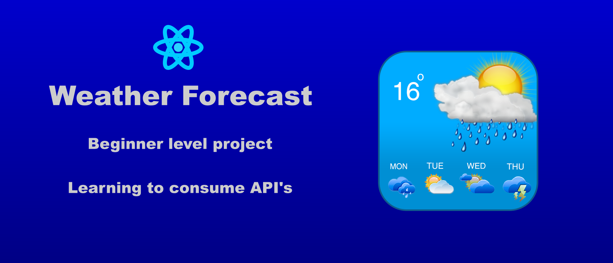
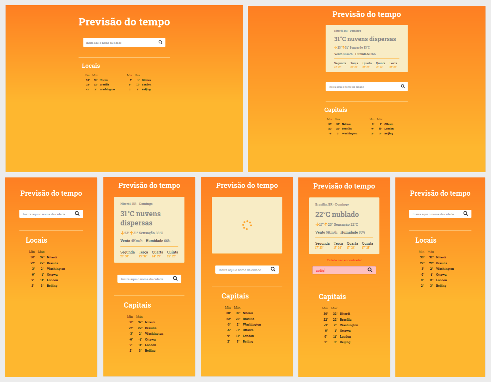

<h1 align="center">
    
</h1>

<p align="center">
  

  

  <a href="https://github.com/orlando-gomes/weather-forecast/commits/master">
    
  </a>

   
</p>

<h4 align="center">
	Weather forecast
</h4>

<p align="center">
 <a href="#screens">Screens</a> •
 <a href="#about">About</a> •
 <a href="#features">Features</a> •
 <a href="#how-it-works">How it works</a> •
 <a href="#tech-stack">Tech Stack</a> •
 <a href="#challenge">Challenge</a> •
 <a href="#author">Author</a> •
 <a href="#user-content-license">License</a>

</p>

## Screens

<p align="center">
  
</p>

---

## About

The Weather-forecast was created with the objective of practicing ReactJS with Typescript, simulating the need to consume a third-party API.

The project is at a beginner level and uses the services of the [Open Weather API] (https://openweathermap.org/).

The initial idea would be to practice doing the [1STi challenge] (https://github.com/1STi/desafio-frontend/), using Yahoo's weather forecasting API. However, when I realized that this API would no longer be free, I looked for another option, so that my project would not stop working due to lack of support.

---

## Features

- [X] When accessing the main screen, the user has access to the local search input. The search starts by clicking on the search icon in the input, or by pressing "enter" on that input.

- [X] A validation is done based on the exception handling eventually received by the API.

- [X] Below the search input, some cities and their maximum and minimum temperatures for the current day are shown. The first of these cities is shown based on the user's location, if access is allowed; otherwise, a statically chosen city will be shown, as well as the other cities in that section.

- [X] After a successful search, a "loading" animation is shown until the next page is loaded. So, a table will be shown with more detailed information about the chosen city. Simple city forecasts for the next five days are also shown.

---

## How it works

This project is composed only of Frontend (execution on the web):

### Pre-requisites

Before you begin, you will need to have the following tools installed on your machine:
[Git] (https://git-scm.com), [Node.js] (https://nodejs.org/en/).
In addition, it is good to have an editor to work with the code like [VSCode] (https://code.visualstudio.com/)

#### Running the application

```bash

# Clone this repository
$ git clone https://github.com/orlando-gomes/weather-forecast.git

# Access the project folder cmd/terminal
$ cd cd weather-forecast

# install the dependencies
$ npm install

# Run the application in development mode
$ npm run start

# The server will start on your default browser at port: 3000 - go to http://localhost:3000

# Before running the application, rename the file ".env.example" to ".env" and replace {YOUR KEY} with the value received by the Open Weather API.

```

---

## Tech Stack

The following tools were used in the construction of the project:

#### **Website**  ([React](https://reactjs.org/)  +  [TypeScript](https://www.typescriptlang.org/))

-   **[Eslint](https://eslint.org/)**
-   **[Prettier](https://prettier.io/)**
-   **[Axios](https://github.com/axios/axios)**
-   **[React Context API](https://pt-br.reactjs.org/docs/context.html)**


> Veja o arquivo  [package.json](https://github.com/orlando-gomes/weather-forecast/blob/master/package.json)

---

## Challenge

The original challenge was using the Yahoo API. Due to the possibility that this API will no longer to be free in the short term, I had to look for another free option and adapt the needs of the project to what the API delivered for free.

Adapting to Typescript is also a challenge itself. All I can say is that this was a very pleasant project to be built.

---

## Author

 
 <br />
 <sub><b style="color: #0480ED;">Orlando Gomes</b></sub>
 <br />

[](https://www.linkedin.com/in/orlando-gomes-da-costa-a65a5384/)
[](mailto:orlandosjm@gmail.com)
[](mailto:orlandosjm@yahoo.com.br)

---

## License

This project is under the license [MIT](./LICENSE).

---

##  Versions of README

[Portuguese 🇧🇷 ](./README.md)  | |  [English 🇺🇸](./README-en.md)|
