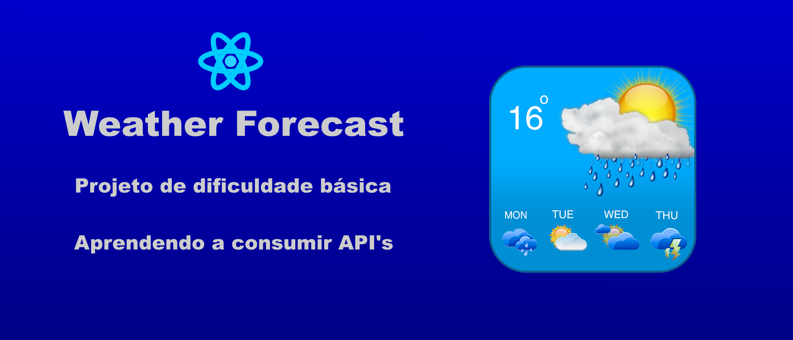

<h1 align="center">
    
</h1>

####  Versões do README [Português 🇧🇷 ](./README.md)  | |  [Inglês 🇺🇸](./README-en.md)|

---


<p align="center">
  

  

  <a href="https://github.com/orlando-gomes/weather-forecast/commits/master">
    
  </a>

   
</p>

<h4 align="center">
	Weather forecast
</h4>

<p align="center">
 <a href="#-telas">Telas</a> •
 <a href="#-sobre-o-projeto">Sobre</a> •
 <a href="#-funcionalidades">Funcionalidades</a> •
 <a href="#-como-executar-o-projeto">Como executar</a> •
 <a href="#-tecnologias">Tecnologias</a> •
 <a href="#-desafio">Desafio</a> •
 <a href="#-autor">Autor</a> •
 <a href="#user-content--licença">Licença</a>
</p>


## Telas

<p align="center">
  
</p>


---

## Sobre o projeto

O Weather-forecast foi criado com objetivo de praticar ReactJS com Typescript, simulando a necessidade de se consumir uma API de terceiros.

O projeto é de nível iniciante e utiliza os serviços da [Open Weather API](https://openweathermap.org/).

A ideia inicial seria praticar fazendo o [desafio da 1STi](https://github.com/1STi/desafio-frontend/), utilizando a API do Yahoo de previsão de tempo. Porém, ao tomar conhecimento de que essa API deixaria de ser free, busquei outra opção, para que meu projeto não deixasse de funcionar por falta de suporte.

---

## Funcionalidades
- [X] Ao acessar a tela principal, o usuário tem acesso à input de pesquisa de locais. A pesquisa tem início ao se clicar no ícone de busca no input, ou ao teclar "enter" nesse input.

- [X] Uma validação é feita com base no tratamento de exceção eventualmente recebida pela API.

- [X] Abaixo do input de busca, são mostradas algumas cidades e suas temperaturas máxima e mínima para o dia corrente. A primeira dessas cidades é mostrada com base na localização do usuário, se permitido o acesso; caso contrário, será mostrada uma cidade escolhida estaticamente, assim como as demais cidades dessa seção.

- [X] Efetuada uma busca com sucesso, uma animação de "loading" é mostrada até o carregamento da próxima página. Então, será mostrado um quadro com informações mais detalhadas sobre a cidade escolhida. São mostrados, ainda, previsões simples dessa cidade para os próximos cinco dias.

---

## Como executar o projeto

Este projeto é composto apenas de Frontend (execução na web):

### Pré-requisitos

Antes de começar, você vai precisar ter instalado em sua máquina as seguintes ferramentas:
[Git](https://git-scm.com), [Node.js](https://nodejs.org/en/).
Além disto é bom ter um editor para trabalhar com o código como [VSCode](https://code.visualstudio.com/). Além disso, você vai precisar de uma chave de acesso à API, que pode ser obtida [nesse link](https://openweathermap.org/appid).

#### Rodando a aplicação

```bash

# Clone este repositório
$ git clone https://github.com/orlando-gomes/weather-forecast.git

# Acesse a pasta do projeto no seu terminal/cmd
$ cd weather-forecast

# Instale as dependências
$ npm install

# Execute a aplicação em modo de desenvolvimento
$ npm run start

# A aplicação será aberta na porta:3000 do seu navegador padrão - acesse http://localhost:3000

# Antes de rodar a aplicação, renomeie o arquivo ".env.example" para ".env" e substitua {YOUR KEY} pelo valor recebido pela Open Weather API.

```

---

## Tecnologias

As seguintes ferramentas foram usadas na construção do projeto:

#### **Website**  ([React](https://reactjs.org/)  +  [TypeScript](https://www.typescriptlang.org/))

-   **[Eslint](https://eslint.org/)**
-   **[Prettier](https://prettier.io/)**
-   **[Axios](https://github.com/axios/axios)**
-   **[React Context API](https://pt-br.reactjs.org/docs/context.html)**


> Veja o arquivo  [package.json](https://github.com/orlando-gomes/weather-forecast/blob/master/package.json)

---

## Desafio

O desafio original previa a utilização da API do Yahoo. Diante da possibilidade de esta API deixar de ser gratuita a curto prazo, precisei buscar outra opção gratuita e adequar as necessidades do projeto ao que a API entrega gratuitamente.

A adaptação ao Typescript também é um desafio por si só. Posso dizer que este foi um projeto bastante aprazivel de ser construído.

---

## O Autor

 
 <br />
 <sub><b style="color: #0480ED;">Orlando Gomes</b></sub>
 <br />

[](https://www.linkedin.com/in/orlando-gomes-da-costa-a65a5384/)
[](mailto:orlandosjm@gmail.com)
[](mailto:orlandosjm@yahoo.com.br)

---

## 📝 Licença

Este projeto esta sobe a licença [MIT](./LICENSE).


